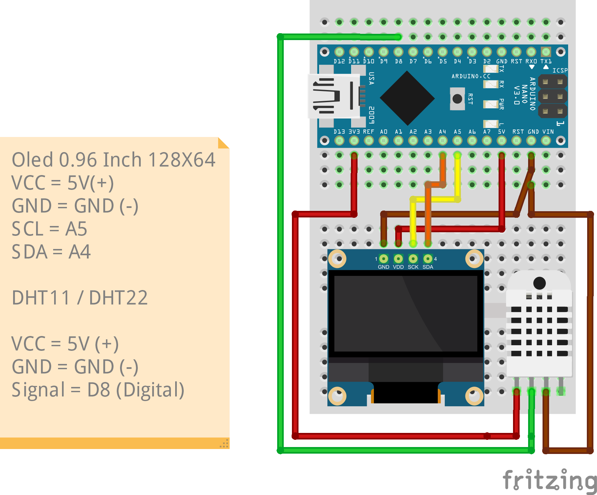

# Arduino Termometre

Bu proje, Arduino ve DHT11 sıcaklık ve nem sensörü kullanarak ortam sıcaklığını ölçer. DHT 22 sıcaklık ve nem sensörünü de kullanabilirsiniz. Proje, Arduino ve DHT11 sensörü ile sıcaklık

## Gereksinimler

- Arduino Mikrodenetleyici (Arduino Nano "Opsiyonel")
- DHT11 sıcaklık ve nem sensörü
- Adafruit SSD1306 0.96inch 128x64 OLED ekran

## Devre Şeması

## Kurulum

1. Arduino IDE'yi açın.
2. İlgili kütüphaneleri (`Adafruit_GFX`, `Adafruit_SSD1306` ve `DHT`) Arduino IDE'ye yükleyin. (Kütüphanelere Libs Klasöründen erişebilirsiniz.)
3. Arduino ve DHT11 sensörünü devreye bağlayın.
4. Arduino kodunu bu projenin ana klasörüne yükleyin.
5. Arduino'yu bilgisayara bağlayın ve kodu yükleyin.

## Kullanım

1. Arduino'yı güç kaynağına bağlayın.
2. Kodu kartınıza yükleyin "Arduino Nano (Opsiyonel)"

## Lisans

Bu proje, MIT Lisansı altında lisanslanmıştır. Daha fazla bilgi için `LICENSE.md` dosyasını inceleyin.

## Katkıda Bulunma

Her türlü katkı ve öneriye açığız. Lütfen `CONTRIBUTING.md` dosyasını okuyun ve nasıl katkıda bulunabileceğinizi öğrenin.

## İletişim

Eğer herhangi bir sorunuz, öneriniz veya geri bildiriminiz varsa, lütfen bize ulaşın: tr.ahmetakifcetin@gmail.com
